<h1 align = "center">Efficient Off-Policy Reinforcement Learning with Cognitive Consistency</h1>

    <a href="https://github.com/DkING-lv6" style="font-size: 23px">Da Wang</a> &emsp;
    <a href="https://scholar.google.com/" style="font-size: 23px">Wei Wei</a> &emsp;
    <a href="https://scholar.google.com/" style="font-size: 23px">Lin Li</a> &emsp;
    <a href="https://scholar.google.com/citations?user=iGc61hUAAAAJ&hl=da" style="font-size: 23px">Jiye Liang</a> &emsp;

<h1 align = "center">Abstract</h1> 

Social psychology and real-world experiences show that humans tend to think and behave in line with their existing knowledge structures, that is, to maintain cognitive consistency. This tendency allows them to achieve satisfactory results in a short time. Cognitive consistency has been demonstrated to be valuable in human-like decision systems such as multi-agent reinforcement learning (RL). Nevertheless, there remains a lack of satisfactory explanations regarding how a single agent can rationally utilize cognitive consistency. In this work, we take the first step towards introducing cognitive consistency into standard off-policy RL for single agents, which involves trading off exploration and exploitation. Existing works tend to train an agent to achieve superhuman performance by prioritizing &quot;diligence &quot;(e.g., encouraging the agent to explore almost the entire state space to ensure accurate target Q-values or more comprehensive exploration), which may not be intelligent enough for sample efficiency. Here, we hypothesize that maintaining cognitive consistency can be advantageous in achieving efficient off-policy RL when ensuring the authority of cognition. We propose a Cognitive Consistency (CoCo) framework, whose principle is to strengthen cognitive authority and alleviate inconsistency. CoCo utilizes a self-imitating approach to train authoritative policies and employs a novel inconsistency minimization objective drawn from label distribution learning to alleviate the inconsistency. These two components are tightly coupled in CoCo through a reweighted, uniformly sampled loss function, and we demonstrate their mutual benefits. We validate our framework on a variety of standard off-policy RL tasks and show that maintaining cognitive consistency substantially improves sample efficiency and performance.

<h1 align = "center">Motivation</h1>

1. Cognitive consistency is a crucial factor that enables humans to acquire effective policies quickly. It has been demonstrated to be valuable in human-like decision systems such as multi-agent RL. However, there is still a lack of satisfactory explanations for how a single agent can rationally utilize cognitive consistency.

2. Existing works are largely heuristically designed, and agents they teach often need to learn strategies &quot;diligently &quot;or even &quot;inch by inch &quot;to achieve the desired performance, which seems somewhat inhuman. This stance is opposed to the cognitive consistency that humans typically maintain and may not be intelligent enough at sample efficiency.

In this paper, we propose a novel framework, termed Cognitive Consistency (CoCo). We propose a hypothesis that rationally utilizing cognitive consistency can enhance the sample efficiency of off-policy RL. The crucial factors are strengthening the authority of cognition and alleviating inconsistency.

<h1 align = "center">Contribution</h1>

1. We take the first step towards introducing cognitive consistency into standard off-policy RL for single agents. We propose a novel framework and demonstrate that strengthening cognitive authority and alleviating inconsistency can enhance sample efficiency.

2. We illustrate a potential issue that affects the efficiency of advanced methods and show that improving cognitive authority is crucial to mitigating this issue. We combine the ultimate goal of RL with the optimal lower bound of the soft Q-value to measure cognitive authority, and propose a self-imitating approach to approximate the most authoritative policy.

3. We analyze the inconsistency issue of the off-policy actor-critic algorithm from the perspective of label distribution learning. To tackle this issue, we introduce an inconsistency minimization objective to alleviate the inconsistency.

<h1 align = "center">Overview</h1>

The principle of CoCo is to strengthen cognitive authority and alleviate inconsistency. 

## Strengthening Cognitive Authority ##

In this section, we first illustrate a potential issue that affects the sample efficiency of the advanced approach, using a didactic example. To mitigate this issue, we introduce cognitive authority and analyze why it is needed. Finally, we propose a self-imitating approach to strengthen the authority.

    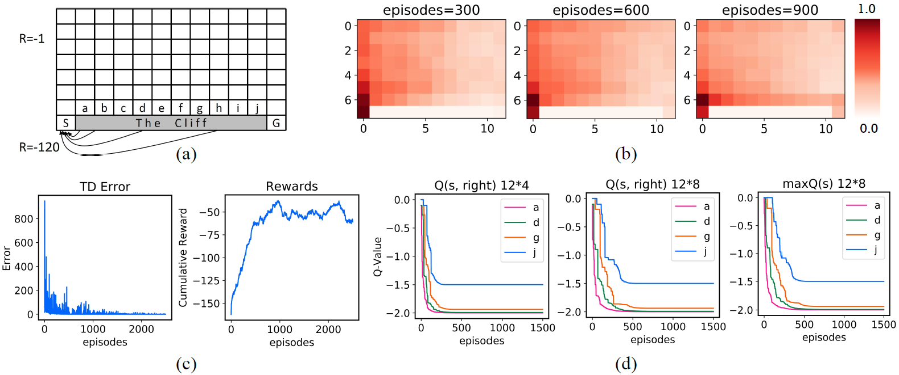

<small> Figure 1. A didactic example. </small>

The detailed analysis and implementation can be found in our paper.

## Alleviating Cognitive Inconsistency ##

In this section, we first analyze the inconsistency issue in RL from the perspective of Label Distribution Learning (LDL), then introduce an inconsistency minimization objective to consolidate cognitive consistency. To our knowledge, this initiative is unexplored in previous RL literature.

    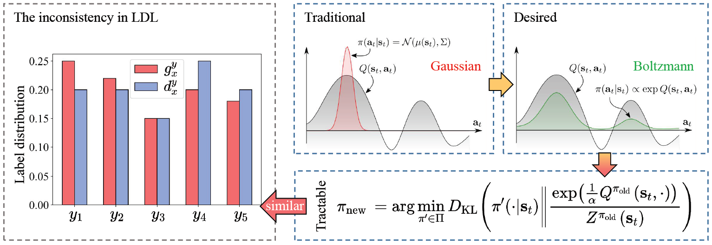

<small> Figure 2. The inconsistency in RL. </small>

The detailed analysis and implementation can be found in our paper.

## The Cognitive Consistency (CoCo) Framework ##

In CoCo, we achieve the above two factors through a self-imitating distribution correction approach and an inconsistency minimization objective, respectively.

    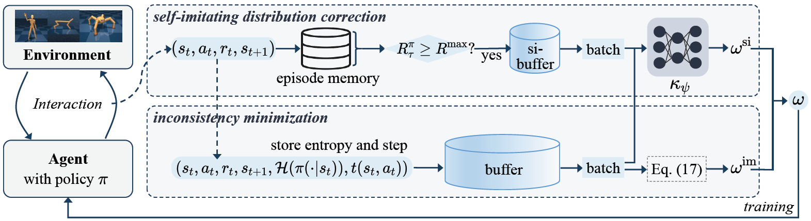

<small> Figure 3. Illustration of CoCo. CoCo consists of two components. In the self-imitating distribution correction component, the samples generated by the high-yield policy are stored as guide data to correct the sampling distribution. In the inconsistency minimization component, it records the action distribution entropy $\mathcal{H}(\pi(\cdot|s))$ and time steps $t(s, a)$ during sample collection, which are used to calculate the inconsistency minimization weight. Finally, the weightings of the two components are integrated to jointly guide the training process. </small>

We also demonstrate their mutual benefits in our paper.

<h1 align = "center">Experiments</h1>

In this section, we conduct experiments to evaluate the gains of CoCo in sample efficiency and performance. We first compare CoCo with related state-of-the-art on-policiness algorithms on Mujoco tasks. Meanwhile, we design ablation experiments to validate the components of CoCo and show that CoCo is robust to noisy reward. Then, We evaluate our methods on Atari games with discrete action spaces, especially demonstrating that CoCo is suitable for hard-exploration tasks. Detailed parameter settings, implementations, and code are available on GitHub\footnote[1]{https://github.com/DkING-lv6/CoCo}.

## Mujoco.

    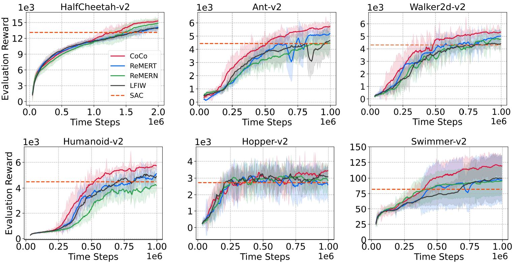

<small> Figure 4. Performance of CoCo (ours), ReMERT, ReMERN and LFIW combined with SAC on Mujoco tasks. </small>

### IQM.
Since the standard deviations of final performance of CoCo overlaps with ReMERT on a couple of tasks, we provide a reliability analysis of the results across all runs (on all the Mujoco tasks). We normalize our experimental data using the performance of SAC as a benchmark and provide the corresponding Interquartile Mean (IQM) results, which are shown in the Fig. 5. It validates that CoCo has the best performance improvement (the largest mean value) and is statistically significant.

    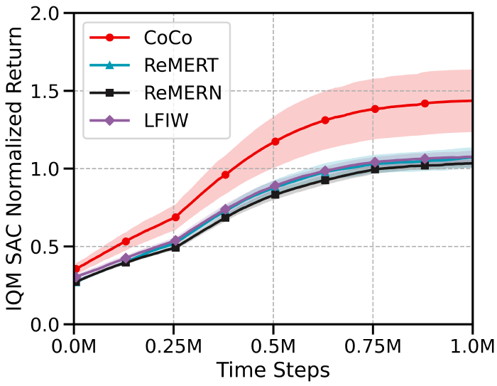

<small> Figure 5. The Interquartile Mean (IQM). </small>

### Ablation.

    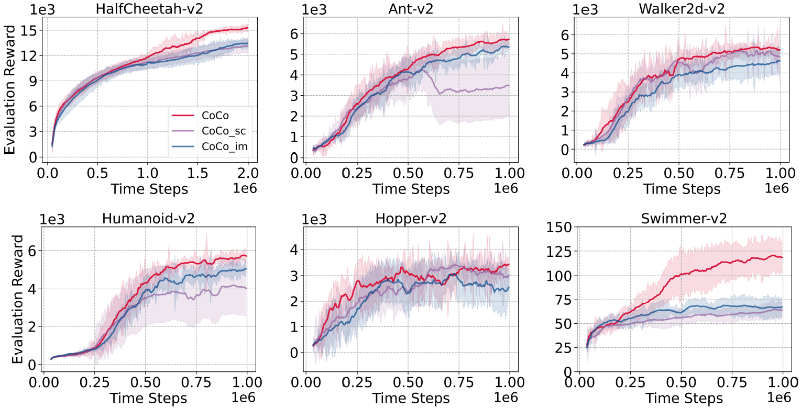

<small> Figure 6. Performance of CoCo, CoCo_sc, and CoCo_im combined with SAC on Mujoco tasks. </small>

    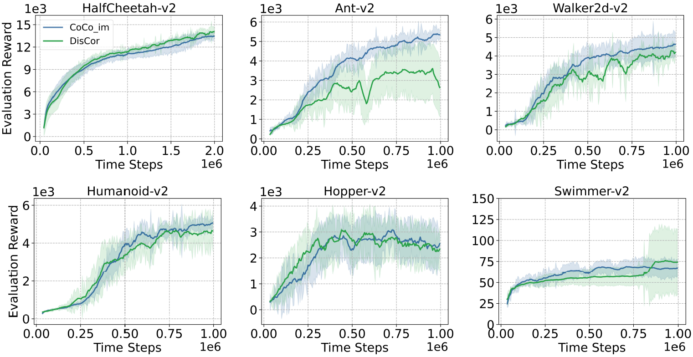

<small> Figure 7. Performance of CoCo_im, and DisCor combined with SAC on Mujoco tasks. </small>

### Noisy Reward Tasks.

    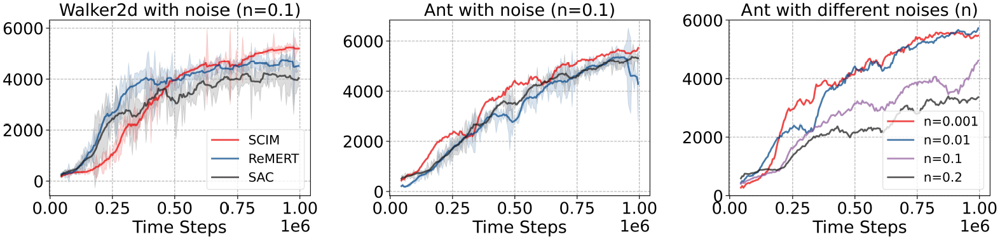

<small> Figure 8. The results of noisy reward tasks. </small>

## Atari.

<small> Table 1. Performances on 20 Atari games after 5M steps of training (20M frames). </small>

    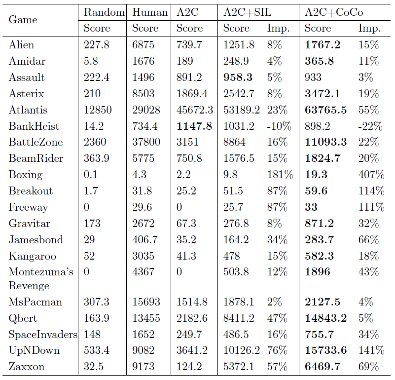

### Visualization.

    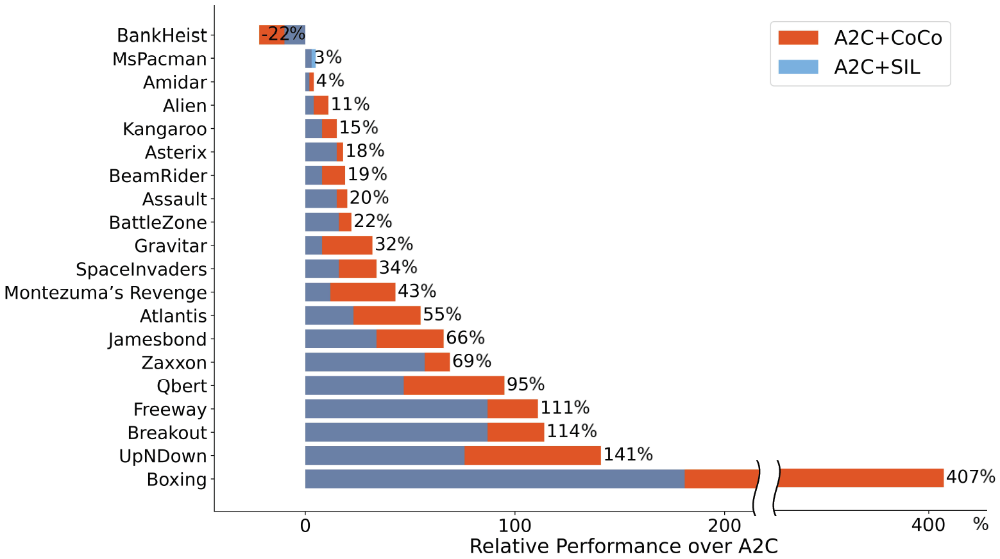

<small> Figure 9. The relative performance over A2C. </small>

### Timesteps Needed.

<small> Table 2. Time steps (M) needed for the relative algorithm to exceed human. </small>

    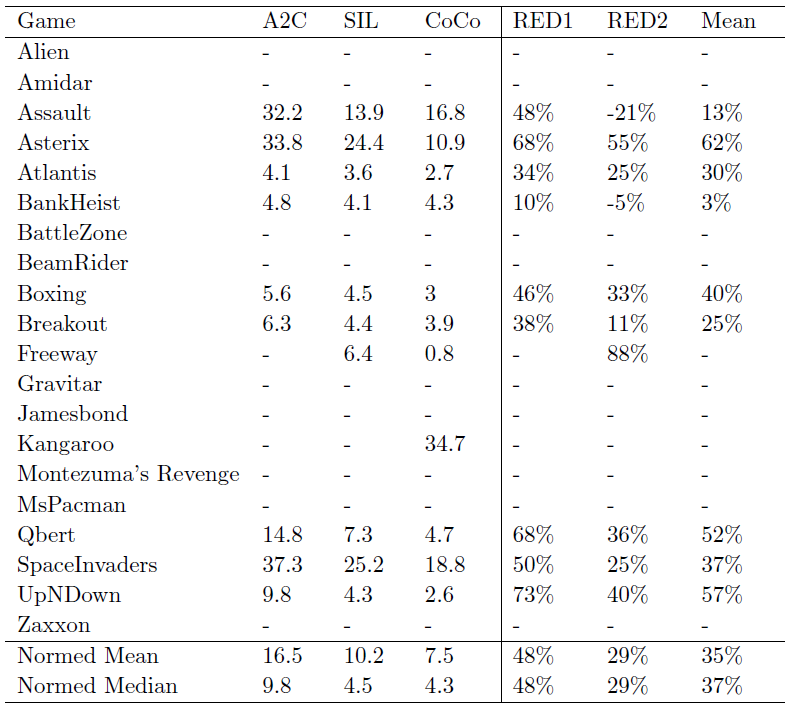

### Hard-Exploration Atari Games.

    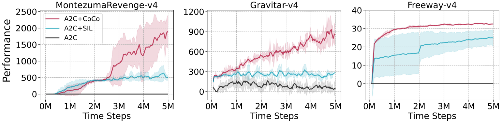

<small> Figure 10. The results of hard-exploration Atari games. </small>

<h1 align = "center">Conclusion</h1>

Our Cognitive Consistency (CoCo) framework provides a fresh perspective on enhancing the sample efficiency of single-agent off-policy RL by enabling agents to possess one of the qualities of human tendencies - maintaining cognitive consistency. We hypothesize that the key factors for the framework&apos;s success are strengthening cognitive authority and alleviating inconsistency. In CoCo, we achieve these factors through a self-imitating distribution correction approach and an inconsistency minimization objective, respectively. Extensive experiments validate our framework and its properties, demonstrating that rational utilization of cognitive consistency can substantially improve sample efficiency and performance of standard off-policy RL methods.

In future work, an exciting direction would be to generalize our framework to model-based RL and offline RL. Additionally, the inconsistency minimization objective proposed in this work investigates the RL problem from the perspective of label distribution learning, generating crossovers that could inspire future investigation.

